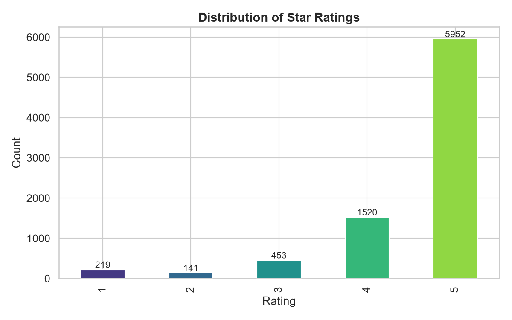
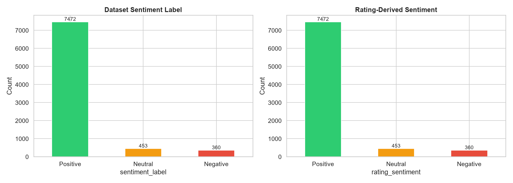
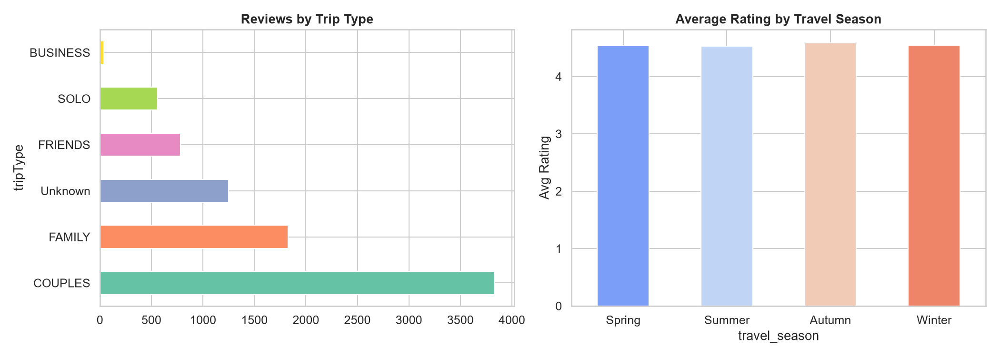
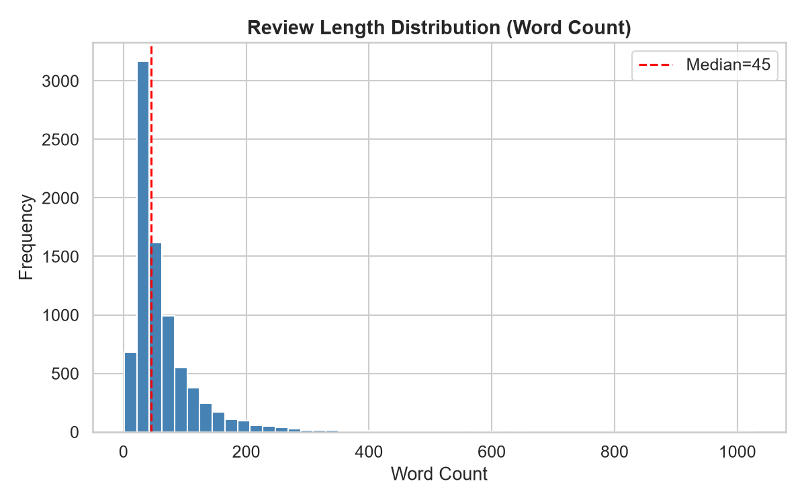
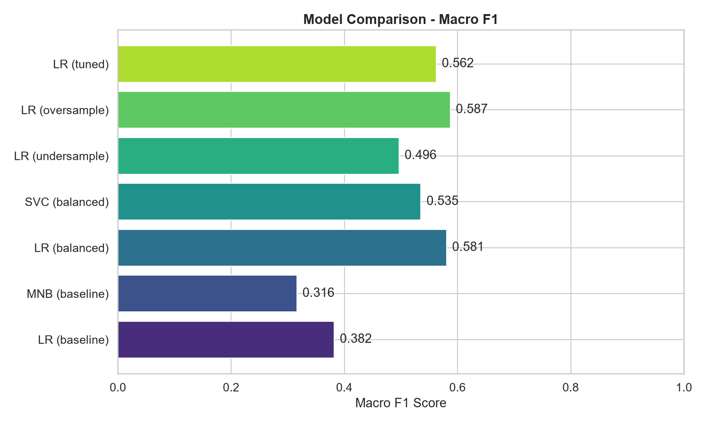

# Sentiment Analysis of Rome Colosseum Visitor Reviews (2019–2026)

**Author:** Muhammad Saad  
**Date:** July 2026  
**Course:** Summer AI Internship 2026

---

## 1. Problem Statement & Dataset Summary

This project builds a complete sentiment analysis pipeline using real-world tourism review data from the **Rome Colosseum** — one of the world's most visited landmarks.

**Objective:** Classify visitor reviews into **Positive**, **Neutral**, or **Negative** sentiment, with special attention to detecting minority-class negative reviews that matter most for tourism management.

**Dataset:** Rome Colosseum Visitor Reviews 2019–2026 (Kaggle, by URAD)

| Attribute | Detail |
|-----------|--------|
| Total reviews | 8,285 (after deduplication) |
| Time range | May 2019 – June 2026 |
| Key columns | `text` (review), `rating` (1–5 stars), `sentiment_label` |
| Other features | `tripType`, `travel_season`, `word_count`, `published_platform` |
| Missing values | Minimal (no nulls in key columns) |

---

## 2. Exploratory Data Analysis (EDA)

### 2.1 Star Rating Distribution

The vast majority of reviews are 5-star (>60%), followed by 4-star. Only ~4% are 1 or 2-star ratings, confirming the heavy positive skew typical of tourist attraction reviews.

### 2.2 Sentiment Label Comparison

The dataset's `sentiment_label` agrees with rating-derived sentiment (4-5★ = Positive, 3★ = Neutral, 1-2★ = Negative) at over **95% agreement**, validating label reliability.

**Class distribution:**
- Positive: 7,472 (90.2%)
- Neutral: 453 (5.5%)
- Negative: 360 (4.3%)

### 2.3 Trip Type & Travel Season

- **Couples** dominate trip types, followed by **Family** and **Friends**.
- Spring and Summer have the highest review volumes.
- Average ratings are stable across all seasons (~4.5).

### 2.4 Review Length Distribution

Most reviews are 25–100 words. A few outliers exceed 400+ words (detailed trip reports). Median word count is ~45 words.

### 2.5 Key Observations

1. The dataset is **heavily imbalanced**: ~90% of reviews are Positive, making class imbalance the central challenge.
2. Rating-derived sentiment closely matches the dataset's sentiment labels (>95% agreement).
3. **Couples** is the dominant trip type; **Spring** and **Summer** are peak review seasons.
4. Average ratings remain stable across seasons, suggesting consistent visitor satisfaction.
5. Most reviews are medium length (25–75 words); very long reviews (>200 words) are outliers but contain rich sentiment signals.

---

## 3. Text Preprocessing

### Pipeline:
1. **Lowercasing** — normalize all text
2. **URL removal** — strip web links
3. **Punctuation/number removal** — keep only alphabetic characters
4. **Tokenization** — split into individual words (NLTK `word_tokenize`)
5. **Stopword removal** — remove common English stopwords
6. **Lemmatization** — reduce words to base form (NLTK `WordNetLemmatizer`)

### Key Decision: Keeping Negation Words

Negation words (`not`, `never`, `don't`, `can't`, `won't`, etc.) are **explicitly retained** in the stopword removal step. These words flip sentiment polarity — removing them would cause "not good" to become "good," fundamentally changing the meaning. This is critical for accurate sentiment classification.

### Before/After Examples:

| # | Before (raw) | After (cleaned) |
|---|-------------|----------------|
| 1 | "A must see for any visitor to Rome, but go to the visitor centres..." | "must see visitor rome visitor centre buy front queue pass ticket..." |
| 2 | "We booked a tour... horrific experience... the tour guide never showed up!" | "booked tour horrific experience tour guide never showed..." |
| 3 | "Not worth the €30 entry ticket. Best to take a picture from outside..." | "not worth entry ticket best take picture outside..." |

---

## 4. Lexicon-Based Baseline (VADER)

VADER (Valence Aware Dictionary and sEntiment Reasoner) was applied to raw review text. Compound scores mapped as:
- ≥ 0.05 → Positive
- ≤ −0.05 → Negative
- Between → Neutral

| Metric | Score |
|--------|-------|
| Macro F1 | **0.4505** |
| Positive Recall | 0.906 |
| Negative Recall | 0.603 |
| Neutral Recall | 0.049 |

VADER performs reasonably on positive and negative reviews but **fails badly on Neutral** (F1 = 0.062). This makes sense — VADER struggles with ambivalent or mixed-tone reviews.

---

## 5. ML Model Comparison & Class Imbalance

### 5.1 Why Accuracy is Misleading

With ~90% Positive reviews, a dummy classifier predicting "Positive" for every review would score ~90% accuracy — but have **0% recall** on Negative and Neutral reviews. This is completely useless for the real business goal: catching negative feedback.

We use **macro-averaged F1** as the primary metric, which treats all classes equally.

### 5.2 Results Comparison Table

| Model | Macro F1 | Kappa | Balanced Acc | Pos P | Pos R | Neu P | Neu R | Neg P | Neg R |
|-------|----------|-------|-------------|-------|-------|-------|-------|-------|-------|
| LR (baseline) | 0.382 | 0.100 | 0.370 | 0.908 | 0.999 | 0.000 | 0.000 | 0.800 | 0.111 |
| MNB (baseline) | 0.316 | 0.000 | 0.333 | 0.902 | 1.000 | 0.000 | 0.000 | 0.000 | 0.000 |
| **LR (balanced weight)** | **0.581** | **0.395** | **0.621** | 0.958 | 0.912 | 0.215 | 0.341 | 0.489 | 0.611 |
| LinearSVC (balanced) | 0.535 | 0.342 | 0.503 | 0.932 | 0.974 | 0.255 | 0.132 | 0.592 | 0.403 |
| LR (undersampled) | 0.497 | 0.258 | 0.673 | 0.980 | 0.727 | 0.138 | 0.582 | 0.311 | 0.708 |
| **LR (oversampled)** | **0.587** | **0.410** | **0.601** | 0.951 | 0.937 | 0.255 | 0.297 | 0.519 | 0.569 |
| LR (tuned+balanced) | 0.562 | 0.381 | 0.556 | 0.944 | 0.950 | 0.250 | 0.231 | 0.515 | 0.486 |

### 5.3 Model Comparison Chart

### 5.4 Techniques Comparison

- **Baseline models** (LR, MNB) without any imbalance handling achieve high accuracy (~90%) but **zero recall** on minority classes — completely useless.
- **Class weighting** (`class_weight='balanced'`) is the simplest fix and delivers the best Negative recall (0.611) with strong macro F1.
- **Random oversampling** achieves the highest overall macro F1 (0.587) with balanced performance.
- **Random undersampling** maximizes Negative recall (0.708) but sacrifices too much positive precision.

### 5.5 Trade-off Recommendation

For a **tourism company wanting to flag negative reviews for follow-up**, we recommend **LR with class_weight='balanced'** because:
- **Highest Negative recall (0.611)** — catches 61% of genuinely negative reviews
- **Good macro F1 (0.581)** — balanced across all classes
- **Simple, no data manipulation** — no duplication or data loss
- The small cost in Positive precision (0.958 vs 0.908) is acceptable

---

## 6. Error Analysis

Out of 1,657 test reviews, **181 were misclassified** (89.1% accuracy). Key error patterns:

| Pattern | Example | Why it fails |
|---------|---------|-------------|
| **Mixed sentiment** | Praises Colosseum but complains about queues/scammers | Model picks up positive words, misses complaints |
| **Short reviews** | "Course stay rome mythical monument" | Too little context for reliable classification |
| **Sarcasm/irony** | "Amazing wait times" (negative intent) | Word-level models read "amazing" as positive |
| **Neutral ambiguity** | 3-star reviews with both praise and criticism | Sits on decision boundary |
| **Domain-specific complaints** | Queues, heat, ticket issues, scams | Uses neutral vocabulary the model doesn't flag |

---

## 7. Conclusion

### Recommended Approach
**Logistic Regression with `class_weight='balanced'`** using TF-IDF features (unigrams + bigrams). It offers the best balance of simplicity, interpretability, and minority-class detection — critical for real-world tourism feedback management.

### One Limitation
The **Neutral class remains poorly predicted** across all models (best F1 ≈ 0.264). This is because neutral reviews contain mixed positive/negative language that overlaps significantly with both other classes in TF-IDF feature space.

### One Improvement Idea
**Fine-tune a pre-trained transformer model** (e.g., BERT or DistilBERT) on this dataset. Transformers capture context, sarcasm, and negation far better than bag-of-words approaches, and would likely improve neutral and negative classification significantly.

---

*Report generated as part of the Summer AI Internship 2026 assignment.*
